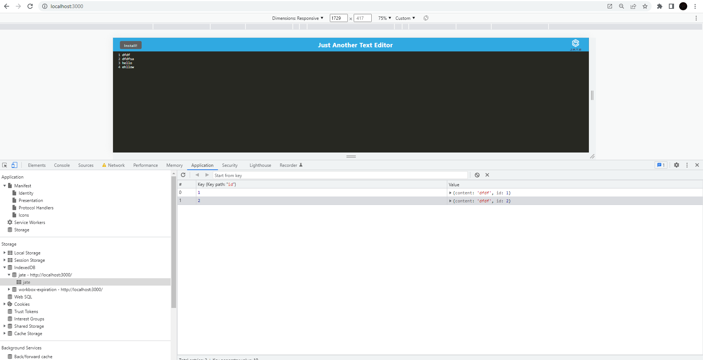
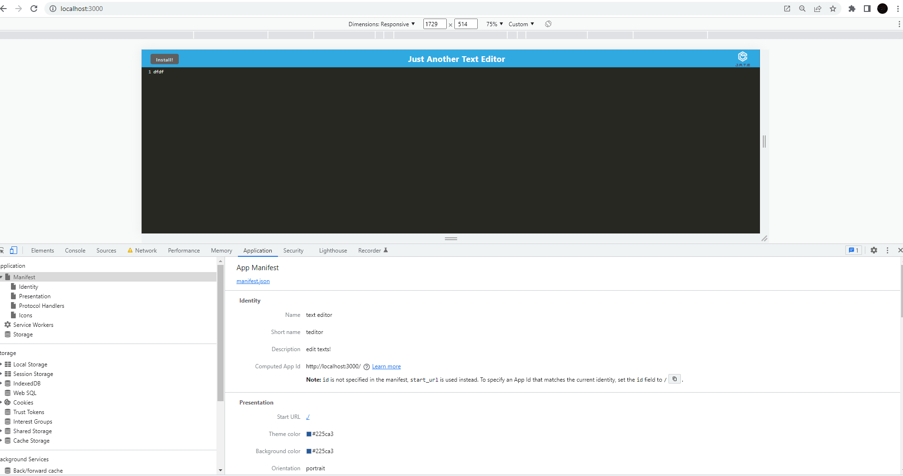
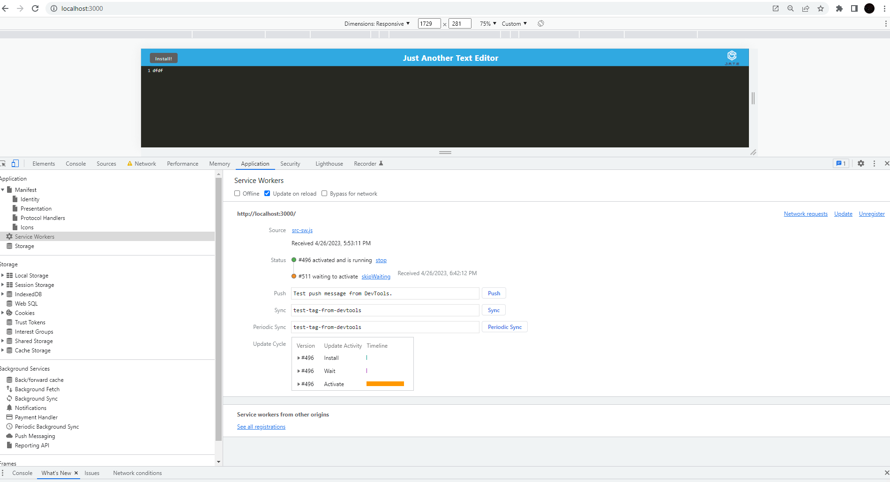

# LightTextEditor
build a text editor that runs in the browser

# description

```
- What was your motivation? I was motivated by the opportunity to create something that I have observed others use on a daily basis.
- Why did you build this project? The purpose of testing was to apply the skills that I acquired during the program.
- What did you learn? How bundle up differnet files.I encounter several problems like the manifest.json file not loading.
```
# table of contents


- [description](#description)
- [table of contents](#tableOfContents)
- [usage/mockUp](#usage/mockUp)
- [license](#license)
- [badges](#badges)
- [deployment/gitHub](#deployment/gitHub)


# Usage/MockUp





    

    
   


# License

[](LICENSE)


# badges


# deployment/gitHub

herokuDeployment: https://lighteditor.herokuapp.com/

gitHub: https://github.com/ricardoci/LightTextEditor

